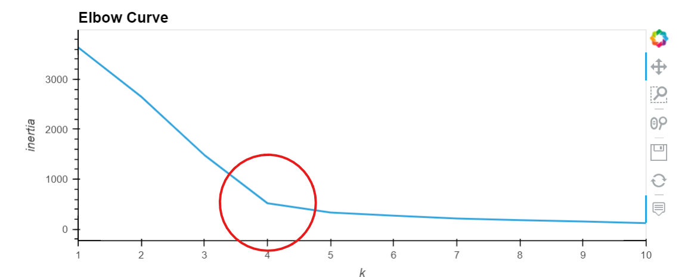
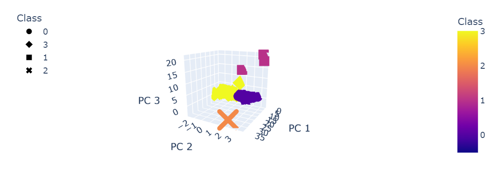
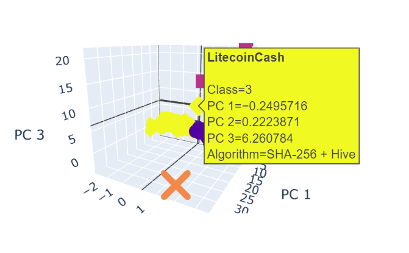
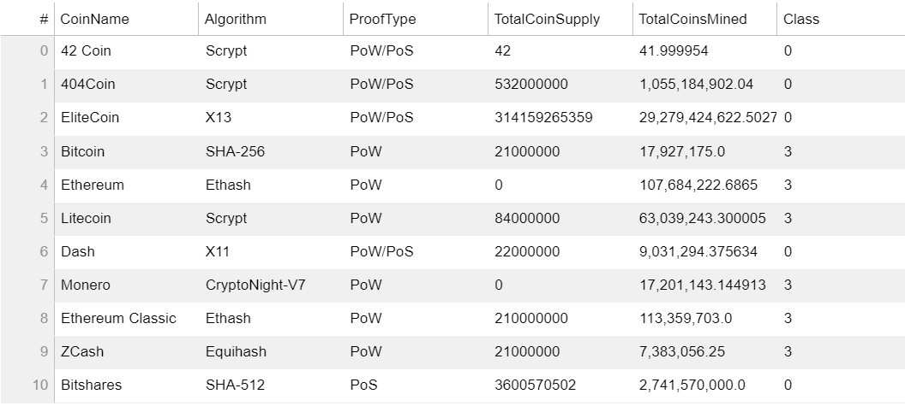
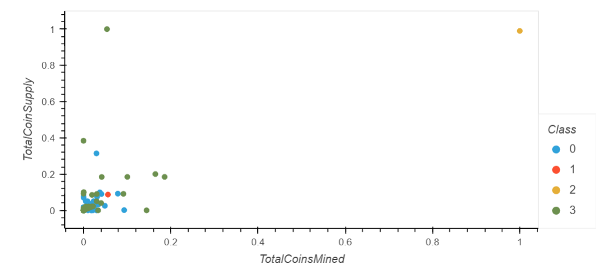

# Cryptocurrencies

## Objective

The purpose of this challenge is to use unsupervised machine learning to analyze a database of cryptocurrencies. Additionally, we are being tasked with creating a report that includes what cryptocurrencies are on the trading market and how they could be grouped to create a classification system for this new investment.

This will be accomplised by completed four technical analysis components including:
- Preprocessing the Data for PCA
- Reducing Data Dimensions Using PCA
- Clustering Cryptocurrencies Using K-means
- Visualizing Cryptocurrencies Results

## Results 

To cleanse the data we confirmed each coin was being traded (IsTrading = TRUE), removed any rows that had at least 1 null value, and ensured the coins are being mined. This resulted in a total of 532 tradeable cryptocurrencies to be analyzed.

Utlizing the Elbow Curve, we determine the best value for K = 4.

Proceeding using 4 clusters, we create a 3D scatter to visualize the Cryptocurrencies results.  The graph has been built with the ability to provide CoinName and data as you hover over each mark.

A table was built with the tradable Cryptocurrencies.

Finally, we plot the data using hvplot.scatter to show the Total Coin Supply vs te Total Coins Mined.

